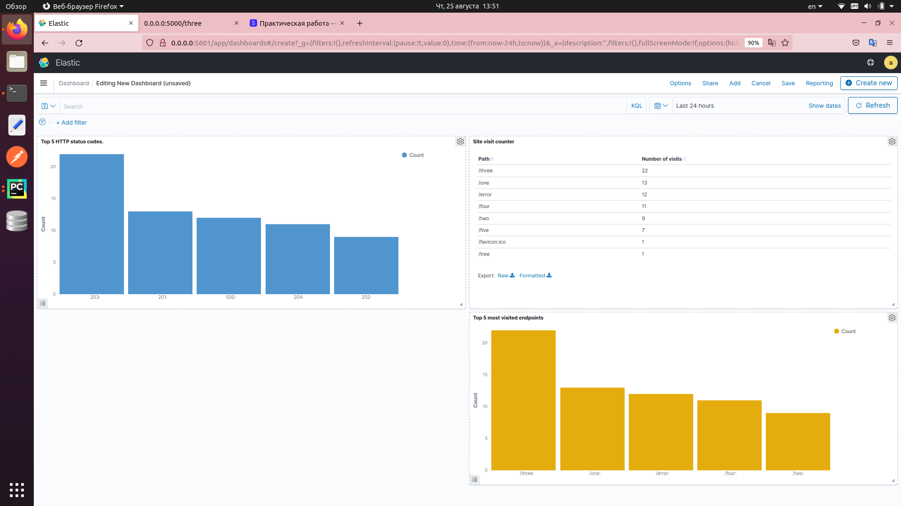

### EFK stack (PET)
## ТЗ

1. Описать docker-контейнеры для flask-приложения, развернутого с помощью gunicorn, fluentd, elasticsearch и kibana.
2. Во flask-приложении опишите 6 роутов (/one, /two, .., /five, /error
, где роуты возвращают HTTP-коды состояния 201, 202,..., 205, 500 соответственно)
3. Опишите конфиг логов для gunicorn.access, чтобы они писали в stdout приложения
4. Опишите конфиг для fluentd, чтобы он забирал логи из stdout
 контейнеров и передавал в elasticsearch. Также необходимо описать шаблон для обработки gunicorn.access логов, используя [fluentd grok plugin](https://github.com/fluent/fluent-plugin-grok-parser).
5. Топ-5 самых посещаемых эндпоинтов в kibana dashboard
6. Счетчик посещений сайта в kibana dashboard
7. Топ-5 кодов состояния HTTP в kibana dashboard

## Реализация
Использован docker compose, содержащий основные контейнеры для поднятия 
сервера gunicorn и flask, а также контейнеры EFK стека, настроена их 
коммуникация. Dashboards настроены локально - скриншот:




Запуск:
```
docker compose up
```

Запросы на flask c помощью клиента
```
python app/client.py
```

Kibana: [kibana-local](http://localhost:5601)